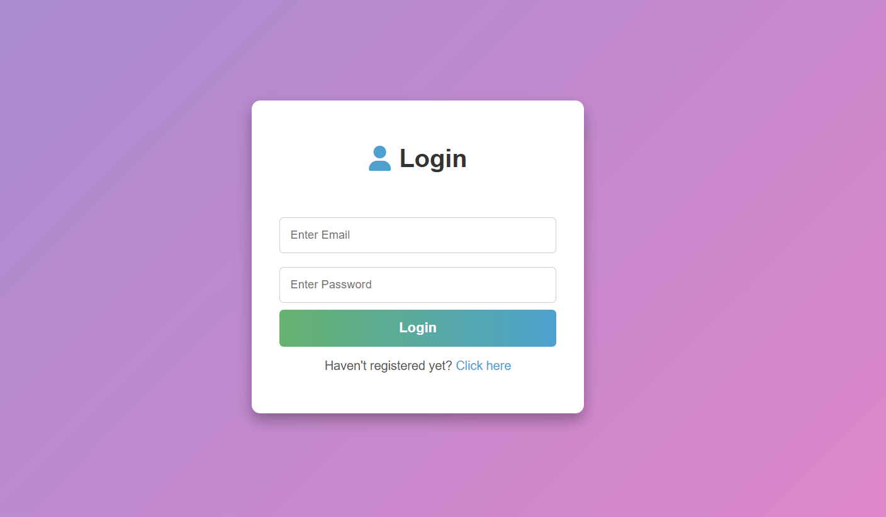
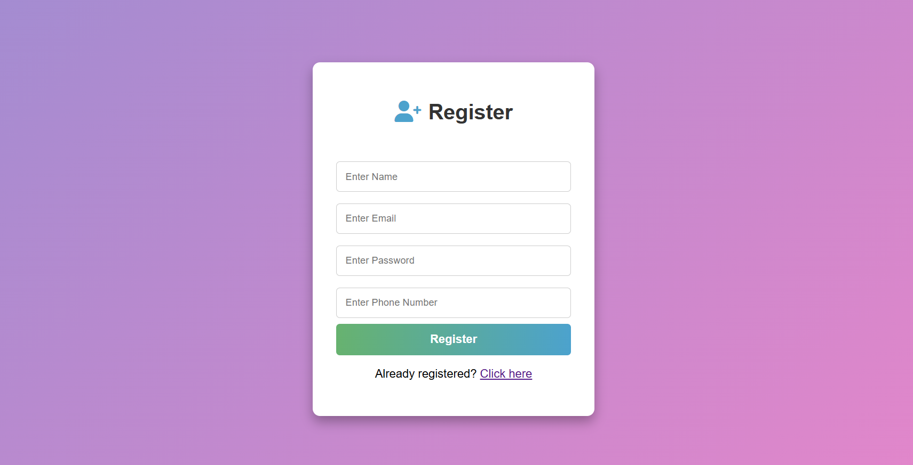
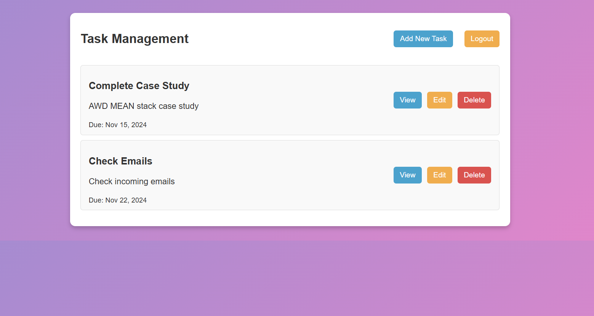
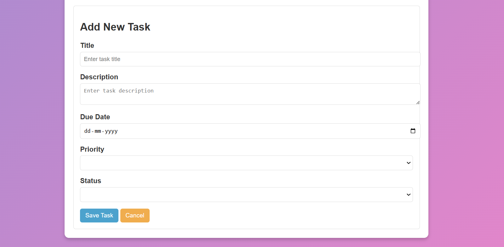
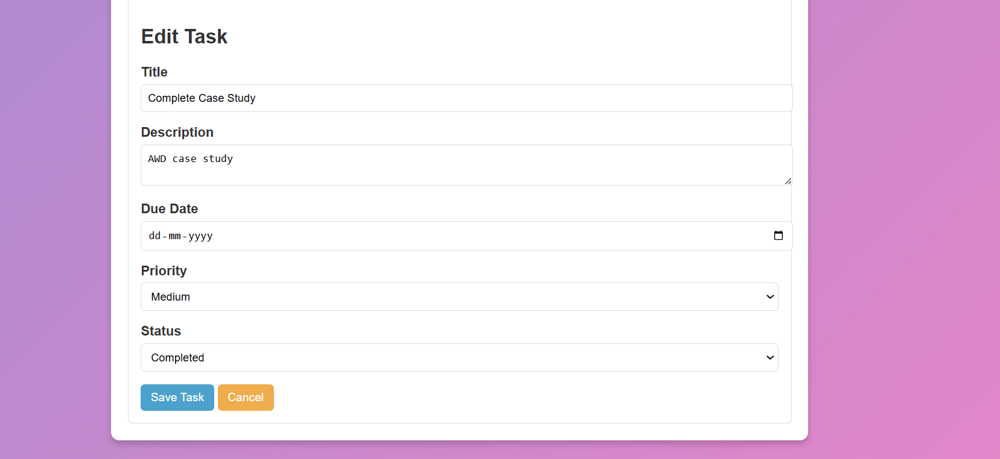

# Task Management System

This project is a web application designed to help users efficiently manage their daily tasks with essential functionalities like registration, login, and task management. The application provides a user-friendly interface for adding, editing, and deleting tasks.

## Features

- **User Interface:**
  - Register and login functionality
  - Add, update, and delete tasks
  - View task list with status updates
  - Logout option to secure user data

## Technologies Used

- **Frontend:** AngularJS, HTML, CSS
- **Backend:** Node.js, Express.js
- **Database:** MongoDB

## Setup

1. **Open in Browser**
   - Visit `http://localhost:3000` to access the app.

## Screenshots 

- **Login Page:**  
  

- **Register Page:**  
  

- **Task Dashboard:**  
  

- **Add Task:**  
  

- **Edit Task:**  
  

